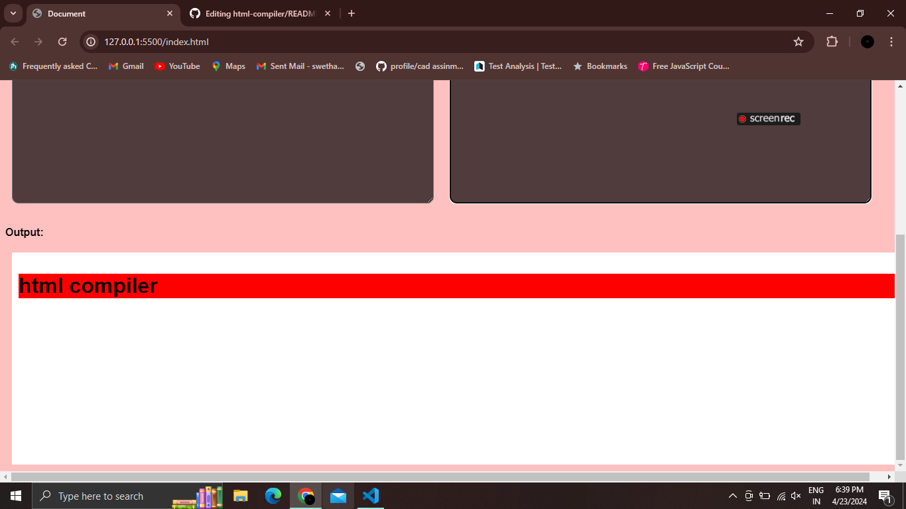
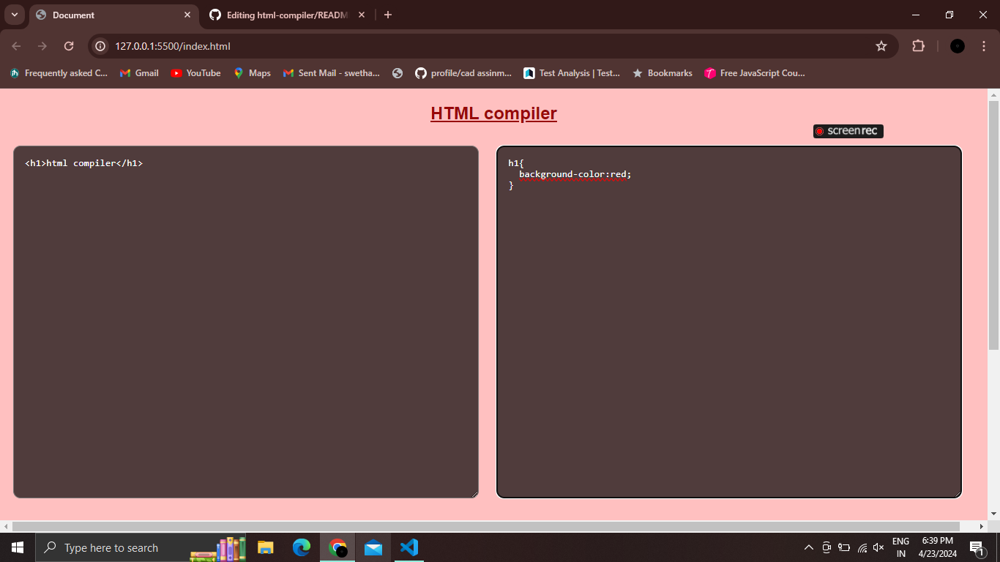

# html-compiler
  --i have created a html compiler using html,css,js. it will compile our html and css code together and give us output automatically.

>output of this project will be like :
<picture>

</picture>

